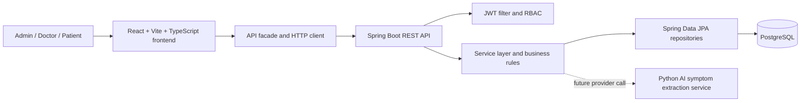

# Telehealth With AI - Development Progress Report

**Project type:** Postgraduate software-engineering project

**Report purpose:** This document records the development work completed so far
in a form suitable for academic review. It explains the project decisions,
technical findings, implemented changes, verification evidence, and the work
that remains. It is a chronological development report, not a claim that the
application is production-ready.

**Reporting convention:** Exact calendar dates were not recorded consistently
throughout the development sessions. Therefore, `Development Day 1` through
`Development Day 15` represent the actual order of work rather than invented
calendar dates. The current verification was completed on 4 August 2026.

**Current project statement:** The application is a role-based telehealth
management system. It supports three user roles (`ADMIN`, `DOCTOR`, and
`PATIENT`), clinical profiles, consultation scheduling and workflow, a mock
symptom-extraction workflow, alerts, and a React client. A Python AI service and
WebRTC video consultation remain planned future phases.

---

## 1. System Design and Requirements

### 1.1 Project purpose

Telehealth With AI is a postgraduate software-engineering project that models
the operational flow of a small telehealth service. It is designed to show how a
secure web application can manage users, clinical profiles, consultations,
transcripts, structured symptom-extraction results, and reviewable alerts.

The project does not claim to deliver autonomous diagnosis or a production
electronic health record. The AI element is treated as clinician-reviewed
decision support. This boundary is important for both technical honesty and
responsible system design.

### 1.2 System user roles

| System role | Primary responsibilities in the system |
|---|---|
| Administrator | Maintains clinics, creates and manages clinical profiles, reviews users, and can oversee consultations and alerts. |
| Doctor | Views authorised consultation work, writes or updates consultation transcript information, requests symptom extraction, and reviews permitted alerts. |
| Patient | Authenticates to the system and views only their own consultation information. |

### 1.3 Functional requirements

The following requirements define the present MVP. Each is implemented fully or
partially as indicated by the current progress sections of this report.

| ID | Requirement |
|---|---|
| FR-01 | The system shall allow Admin, Doctor, and Patient users to authenticate with a username/email and password. |
| FR-02 | The system shall issue a JWT access token after valid authentication and reject invalid credentials without exposing sensitive detail. |
| FR-03 | The system shall enforce role-based access control for API routes and user-interface navigation. |
| FR-04 | The system shall maintain separate AppUser identity records and Doctor/Patient clinical profiles. |
| FR-05 | The system shall allow authorised administrators to manage clinics, users, doctors, patients, and consultations. |
| FR-06 | The system shall create Doctor and Patient accounts together with their corresponding clinical profile. |
| FR-07 | The system shall preserve clinical history when an account is archived and prevent archived accounts from signing in. |
| FR-08 | The system shall allow an authorised user to create, read, and manage consultations according to role and ownership rules. |
| FR-09 | The system shall prevent a Patient from reading another Patient's consultations and prevent a Doctor from managing another Doctor's consultations. |
| FR-10 | The system shall restrict consultation and alert status updates to legal state transitions. |
| FR-11 | The system shall store a consultation transcript and produce a structured symptom-record snapshot from it. |
| FR-12 | The system shall allow authorised staff to review and progress alerts generated or recorded for clinical review. |
| FR-13 | The system shall present role-aware React views and user feedback for CRUD actions and validation errors. |
| FR-14 | The system shall provide seeded demonstration data for reproducible local evaluation. |

### 1.4 Non-functional requirements and design constraints

| ID | Requirement / constraint | Current approach |
|---|---|---|
| NFR-01 | Confidentiality | BCrypt password hashes, JWT authentication, RBAC, record-level ownership checks, and safe response DTOs. |
| NFR-02 | Integrity | PostgreSQL foreign keys, unique constraints, service-level relation checks, and controlled state machines. |
| NFR-03 | Maintainability | Layered Spring Boot packages, DTO boundaries, reusable frontend components, and an API facade. |
| NFR-04 | Usability | Role-aware navigation, form validation, field errors, success feedback, recovery actions, and safe form defaults. |
| NFR-05 | Testability | Docker-backed seeded data, API/service integration tests, deterministic error contract, and a mock AI provider. |
| NFR-06 | Extensibility | A staged plan for a Python AI provider and WebRTC integration without rewriting the core consultation model. |
| NFR-07 | Academic scope control | The implementation prioritises demonstrable correctness over production-only infrastructure. |

### 1.5 Architecture overview

The application uses a separated frontend and backend architecture. The React
client is responsible for presentation, local session state, forms, and calling
the API facade. The Spring Boot application is the source of truth for business
rules, authorisation, persistence, and API responses. PostgreSQL stores the
relational data. The future Python AI service is deliberately placed behind a
provider boundary so that the current mock implementation can be replaced.



### 1.6 Backend component responsibilities

| Component | Responsibility |
|---|---|
| React frontend | Displays role-specific pages, gathers form input, renders validation/API feedback, and sends authenticated API requests. |
| API facade | Gives frontend pages one stable entry point and prevents HTTP logic from being duplicated across screens. |
| Spring controllers | Define REST routes, apply `@Valid`, and delegate work to services. |
| Spring services | Apply transactions, duplicate checks, account/profile lifecycle rules, status transitions, and record-level permissions. |
| Spring Security | Authenticates Bearer JWT tokens and enforces route/method role restrictions. |
| DTO layer | Separates public request/response contracts from JPA entities and keeps password hashes out of responses. |
| PostgreSQL | Persists accounts, profiles, clinics, consultations, symptom snapshots, and alerts with relational constraints. |
| Mock AI provider | Demonstrates extraction workflow while the Python implementation is not yet available. |
| Future Python AI service | Will receive transcript text and return a validated structured symptom result through a controlled contract. |

### 1.7 Entity-relationship model

The model separates login identity from clinical profile. An `AppUser` is the
security identity; a Doctor or Patient is the domain profile associated with that
identity. Consultations are the central transactional entity joining the Patient,
the assigned Doctor account, and a Clinic.

```mermaid
erDiagram
    APP_USER ||--o| DOCTOR : "has doctor profile"
    APP_USER ||--o| PATIENT : "has patient profile"
    PATIENT ||--o{ CONSULTATION : "attends"
    APP_USER ||--o{ CONSULTATION : "acts as clinician"
    CLINIC ||--o{ CONSULTATION : "hosts"
    CONSULTATION ||--o{ SYMPTOM_RECORD : "produces"
    CLINIC ||--o{ ALERT : "owns"

    APP_USER {
        bigint user_id PK
        string username UK
        string email UK
        string password_hash
        string role
        boolean enabled
    }
    DOCTOR {
        bigint doctor_id PK
        bigint app_user_id FK_UK
        string first_name
        string last_name
        string specialty
    }
    PATIENT {
        bigint patient_id PK
        bigint app_user_id FK_UK
        string first_name
        string last_name
        string nhs_number
    }
    CLINIC {
        bigint clinic_id PK
        string name
        string address
    }
    CONSULTATION {
        bigint consultation_id PK
        bigint patient_id FK
        bigint clinician_id FK
        bigint clinic_id FK
        datetime scheduled_at
        string status
        text transcript
    }
    SYMPTOM_RECORD {
        bigint symptom_record_id PK
        bigint consultation_id FK
        jsonb symptom_snapshot
        datetime created_at
    }
    ALERT {
        bigint alert_id PK
        bigint clinic_id FK
        string status
        string type
    }
```

### 1.8 Relationship rules and integrity policy

| Relationship | Cardinality | Integrity rule |
|---|---|---|
| AppUser - Doctor | One to zero/one | A Doctor profile has one unique account; the linked account must have role `DOCTOR`. |
| AppUser - Patient | One to zero/one | A Patient profile has one unique account; the linked account must have role `PATIENT`. |
| Patient - Consultation | One to many | Every consultation references one valid Patient. |
| Doctor account - Consultation | One to many | Every consultation references one clinician account associated with a Doctor profile. |
| Clinic - Consultation | One to many | Every consultation is associated with one valid Clinic. |
| Consultation - SymptomRecord | One to many | A consultation may have zero or more immutable extraction snapshots. |
| Clinic - Alert | One to many | An alert belongs to one Clinic and follows a controlled workflow state. |

The application relies on both database constraints and service checks. Database
constraints prevent invalid references at persistence level; service checks add
meaningful messages and authorisation logic before an invalid change reaches the
database.

### 1.9 Primary data and security flows

**Authentication flow**

```text
Login DTO -> AuthenticationManager -> AppUser lookup -> JWT generation
         -> AuthResponse -> frontend token storage -> Bearer token on API calls
```

**Consultation access flow**

```text
Bearer token -> SecurityContext user -> ConsultationService
             -> role check + ownership check -> authorised response or 403/404
```

**Symptom extraction flow (current and future)**

```text
Authorised Doctor/Admin -> consultation transcript check -> extractor provider
                         -> SymptomRecord JSONB snapshot -> alert workflow

Current provider: MockSymptomExtractionService
Future provider:  Python AI HTTP service
```

---

## 2. Executive Summary

The project has progressed from an initial domain design to a working Spring
Boot/PostgreSQL backend and a React/Vite frontend. The most important completed
technical foundations are:

- A relational PostgreSQL schema with seeded data and verified links between
  accounts, profiles, consultations, clinics, symptom records, and alerts.
- A layered Spring Boot backend using controllers, DTOs, services,
  repositories, security components, and global exception handling.
- Transactional Patient and Doctor creation, where each clinical profile is
  created together with the account used to sign in.
- Stateless JWT authentication and role-based access control (RBAC).
- Record-level consultation authorisation: a patient can access only their own
  consultations, and a doctor can manage only consultations assigned to them.
- Controlled consultation and alert status transitions rather than unrestricted
  updates.
- A mock symptom-extraction implementation that proves the domain workflow
  before a real Python AI integration is introduced.
- A React/Vite frontend with role-aware views, CRUD forms, feedback messages,
  field-error handling, and route protection.
- Automated regression tests for the most important authentication,
  authorisation, ownership, and alert-transition rules.

The project is deliberately scoped as a student final project. It does not yet
attempt production-level features such as refresh tokens, password-reset email,
external identity providers, audit infrastructure, real AI processing, video
calling, or cloud deployment. This is an intentional sequencing decision: core
data integrity, CRUD behaviour, and security rules were completed first.

---

## 3. Scope, Architecture, and Current Baseline

### 2.1 Functional scope

The current application models the following workflow:

```text
Authentication
    -> role-aware dashboard
    -> clinical profile and account management
    -> consultation scheduling and management
    -> transcript entry
    -> symptom extraction snapshot
    -> clinical alert review
```

The system is not presented as a medical diagnostic product. The current symptom
extraction is a controlled mock used to demonstrate how a transcript can become
a structured clinical record and then generate reviewable alerts.

### 2.2 Backend architecture

The backend follows a conventional layered design:

| Layer | Main responsibility | Examples |
|---|---|---|
| `controller` | HTTP routes, request validation, response status | `AuthController`, `ConsultationController` |
| `dto/request` | Inputs accepted from the client | `LoginRequest`, create/update DTOs |
| `dto/response` | Safe data returned to the client | `AuthResponse`, profile and consultation responses |
| `service` | Business rules, transactions, ownership checks | `ConsultationService`, `AlertService` |
| `repository` | Database access through Spring Data JPA | `AppUserRepository`, domain repositories |
| `model` | JPA entities and enums | `AppUser`, `Patient`, `ConsultationStatus` |
| `security` | JWT generation, filter chain, entry points | `JwtService`, `SecurityConfig` |
| `exception` | Central, safe error responses | `GlobalExceptionHandler`, `ErrorResponse` |

This separation prevents controllers from becoming business-logic classes and
prevents database entities from being exposed directly as public API contracts.

### 2.3 Main data relationships

```text
AppUser (login identity)
  |-- one-to-one --> Doctor  (for a DOCTOR account)
  |-- one-to-one --> Patient (for a PATIENT account)

Patient -- one-to-many --> Consultation <-- one-to-many -- Doctor account
Clinic  -- one-to-many --> Consultation
Consultation -- one-to-many --> SymptomRecord
Clinic -- one-to-many --> Alert
```

An important implementation detail is that `Doctor.doctorId` and
`AppUser.userId` are different identifiers. The Doctor profile has its own
primary key, while a consultation's clinician identity is based on the linked
doctor account. Keeping this distinction explicit avoided incorrect form
mapping and authorisation decisions.

### 2.4 Current verification baseline

At the time of this report:

- The backend test suite passes with `./mvnw -q test`.
- Seed-integrity SQL checks return zero invalid Patient-account links, zero
  invalid Doctor-account links, and zero invalid consultation links.
- A freshly restarted local backend on `localhost:8081` returns a JSON `401
  Unauthorized` response for invalid login credentials.
- The frontend production build has previously passed TypeScript checking and
  Vite production build verification. The remaining frontend scope is discussed
  under future work.

---

## 4. Chronological Development Record

## Development Day 1 - Definition of Project Scope and Academic Boundaries

### Objective

Define a deliverable that demonstrates a meaningful telehealth workflow without
trying to reproduce a production hospital system within a final-project time
frame.

### Findings

- The initial concept included many potentially large features: microservices,
  WebRTC, AI, authentication, RBAC, CRUD, and clinical data.
- Attempting all of these at production depth would increase risk and reduce the
  quality of the core implementation.
- A clear minimum viable product was required before advanced integrations.

### Decisions and changes

- Defined three system roles: `ADMIN`, `DOCTOR`, and `PATIENT`.
- Defined the initial core entities: AppUser, Doctor, Patient, Clinic,
  Consultation, SymptomRecord, and Alert.
- Selected Spring Boot and PostgreSQL for the backend, and React/Vite for the
  frontend.
- Defined a staged roadmap: first CRUD and security, then consultation workflow,
  then mock AI workflow, then real Python AI and video functionality.
- Explicitly deferred production-only concerns such as Kubernetes, Kafka,
  refresh tokens, advanced monitoring, and OAuth.

### Why this matters

This decision established an academically realistic scope. It makes the final
demonstration coherent: the project can show a complete data and security flow
before moving to optional technical complexity.

### Evidence of progress

The later architecture, database schema, DTOs, security configuration, and
frontend specification all follow this three-role, staged model.

### Follow-up

The deferred Python AI and WebRTC work are retained as future phases rather than
removed from the project vision.

---

## Development Day 2 - Domain Model and Package Structure

### Objective

Establish the Java package structure and entity relationships before writing
large amounts of endpoint code.

### Findings

- Account data and clinical profile data have different lifecycles and should
  not be collapsed into a single class.
- Directly connecting a Doctor object to a Patient object through Clinic would
  create misleading relationships; the consultation is the correct operational
  link between these concepts.
- Clear package ownership is necessary to keep the project understandable as it
  grows.

### Decisions and changes

- Created separate packages for `model`, `repository`, `service`, `controller`,
  `dto`, `security`, and `exception` responsibilities.
- Modelled `AppUser` as the identity used for login, role, password hash, and
  enabled/archive state.
- Modelled `Doctor` and `Patient` as separate clinical profiles linked one-to-one
  to an AppUser account.
- Modelled Clinic as an organisation/location entity rather than a container
  holding a single Doctor and Patient.
- Modelled Consultation as the relationship that connects Patient, Doctor,
  Clinic, scheduled time, transcript, and workflow status.
- Added enums for roles and statuses rather than storing unrestricted strings.

### Key technical finding

The project had to distinguish between a Doctor profile identifier and the user
identifier of the doctor account. The clinician stored in a consultation is the
doctor's `AppUser.userId`. This decision is essential for comparing the currently
authenticated user with the doctor assigned to a consultation.

### Verification approach

The relationships were then implemented as JPA mappings and reflected in the
PostgreSQL foreign keys introduced on the following development day.

### Follow-up

The model was intentionally kept small. Features such as prescriptions, medical
documents, multiple clinic memberships, and multi-doctor teams are outside the
current final-project scope.

---

## Development Day 3 - PostgreSQL Schema, Docker Setup, and Seed Data

### Objective

Provide reproducible relational data for local development, API testing, and the
final demonstration.

### Findings

- A demo application cannot be reliably evaluated with empty tables or manually
  created records only.
- Seeded profiles must be linked to login accounts with the correct role.
- Deleting or changing accounts without foreign-key awareness can break clinical
  history and invalidate the demonstration data.

### Decisions and changes

- Added Docker-based PostgreSQL configuration and database initialisation files.
- Created tables for `app_user`, `doctor`, `patient`, `clinic`, `consultation`,
  `symptom_record`, and `alert`.
- Added primary keys, foreign keys, unique constraints, and appropriate date/time
  storage.
- Added `enabled` to the account model so that an account can be archived without
  removing clinical history.
- Seeded demonstration accounts for Admin, Doctor, and Patient roles using
  BCrypt-compatible password hashes.
- Seeded linked Doctor and Patient profiles, clinics, consultations, symptom
  records, and alerts so that each screen and endpoint has realistic data.

### Database findings and corrective work

During later checks, account/profile links and ID sequences were reviewed. The
seed data was corrected so that each linked Patient account has role `PATIENT`,
each linked Doctor account has role `DOCTOR`, and consultation foreign keys point
to valid Patient, clinician, and Clinic records.

### Verification evidence

Three integrity checks were executed against the current database:

| Check | Expected result | Current result |
|---|---:|---:|
| Patient profile with missing or non-PATIENT account | 0 | 0 |
| Doctor profile with missing or non-DOCTOR account | 0 | 0 |
| Consultation with invalid Patient, clinician, or Clinic relationship | 0 | 0 |

### Follow-up

The current seed data is suitable for a student demonstration. It is not intended
to represent anonymised real patient data or a production migration strategy.

---

## Development Day 4 - DTO Design and Request Validation

### Objective

Prevent direct exposure of JPA entities and introduce a stable HTTP API contract.

### Findings

- Returning entities directly can reveal fields that should remain private, such
  as password hashes or internal relationship details.
- Create and update operations do not always accept the same fields.
- Validation rules have two different locations: simple input-shape rules belong
  to DTOs, while relational and business rules belong to services.

### Decisions and changes

- Added request DTOs for create, update, login, transcript, and status-change
  actions.
- Added response DTOs for users, doctors, patients, consultations, alerts, and
  authentication.
- Added Bean Validation constraints such as `@NotBlank`, `@NotNull`, `@Email`,
  `@Size`, and `@Future` where appropriate.
- Used `@Valid` in controllers so invalid request fields are rejected before a
  service operation is attempted.
- Ensured password fields are accepted only in request DTOs and are never
  returned in response DTOs.

### Important distinction identified

`@Valid` can validate that an email is syntactically valid or that a scheduled
time is supplied. It cannot decide whether the selected patient exists, whether a
doctor owns a consultation, or whether a status transition is legal. Those rules
were therefore implemented in service methods.

### Example of the contract approach

`CreateConsultationRequest` validates the presence of patient, clinician, clinic,
and a future scheduled time. `ConsultationService` subsequently verifies that the
referenced records exist and that the current user has authority to create the
consultation.

### Follow-up

The DTO layer remains the boundary for frontend-backend integration. Any future
Python service response will also be mapped through a dedicated DTO/model rather
than exposed directly to the client.

---

## Development Day 5 - CRUD Services and REST Controllers

### Objective

Implement the main create, read, update, and archive/delete workflows for the
core entities.

### Findings

- CRUD endpoints are not simply repository calls; they require duplicate checks,
  relationship checks, mapping, and role-specific behaviour.
- Creating a patient or doctor profile without a login account creates an
  incomplete workflow.
- Creating an account without its required clinical profile creates the reverse
  problem: an orphan account.

### Decisions and changes

- Implemented REST controllers for users, doctors, patients, clinics,
  consultations, alerts, symptom records, and authentication.
- Kept controllers thin: they define routes, validate DTOs, call services, and
  return HTTP responses.
- Moved business logic to service classes, including entity lookup, duplicate
  detection, mapping, lifecycle operations, and transaction boundaries.
- Implemented Doctor and Patient creation as combined account-plus-profile
  transactions. The service creates the AppUser with the correct role, stores it,
  links it to the profile, and stores the profile.
- Added Clinic CRUD and the initial Consultation create/read/status/transcript
  endpoints.

### Corrective finding

Early frontend work exposed ambiguity around selecting a doctor account versus a
doctor profile. The backend contract was clarified so account and profile links
are explicit. This reduced the risk of assigning a consultation to the wrong
identifier.

### Verification approach

Endpoints were exercised through local API testing and subsequently through the
React client. Later integration tests cover sensitive endpoints and confirm that
the expected role restrictions remain in place.

### Follow-up

CRUD is complete at the academic MVP level. Advanced concerns such as field-level
audit history, optimistic locking, bulk actions, and soft-delete recovery screens
are intentionally not part of the first delivery.

---

## Development Day 6 - Account/Profile Integrity and Archive Policy

### Objective

Resolve data-lifecycle problems discovered during account and profile CRUD
testing.

### Findings

The following risks were identified during frontend/backend review:

1. A linked Doctor or Patient account could potentially have its role changed,
   breaking the meaning of the existing profile.
2. A profile deletion could leave a sign-in account behind without a valid
   clinical profile.
3. A generic user creation screen could create Doctor or Patient accounts that
   had no corresponding profile.
4. Physical deletion of a clinical account could damage consultation and symptom
   history.

### Decisions and changes

- Protected linked Doctor and Patient accounts from role changes.
- Restricted standalone `/api/users` creation to `ADMIN` accounts; Doctor and
  Patient accounts must be created via the dedicated profile workflows.
- Introduced archive behaviour through `AppUser.enabled = false` instead of
  physical account deletion for clinical users.
- Configured authentication so a disabled account cannot log in.
- Preserved related clinical records for historical consistency.
- Repaired and revalidated seeded profile/account links.

### Design rationale

An archive policy is more appropriate than a separate “deleted users” table for
the present scope. A separate table would duplicate identity data and introduce
additional foreign-key and restoration complexity. `enabled=false` keeps the
identity record, marks it unavailable for login, and preserves the relations
needed to explain historic consultations. A production system could later add an
audit log or anonymisation policy, but neither is required for this project.

### Verification evidence

An integration test confirms that an administrator cannot change the role of a
linked Patient account from `PATIENT` to `ADMIN`.

### Follow-up

Future work could add explicit “archived” filters, restore actions, and an audit
trail showing who archived an account and when.

---

## Development Day 7 - JWT Authentication and Role-Based Access Control

### Objective

Replace temporary browser/form authentication with stateless API authentication
that a React frontend can use safely and consistently.

### Findings

- Form login and HTTP Basic authentication create an awkward user experience for
  a single-page application and do not match the intended API architecture.
- Authentication (who is the user?) and authorisation (may that user perform this
  action?) require separate controls.
- HTTP status semantics matter: invalid credentials must result in `401`, not a
  generic input error.

### Decisions and changes

- Added `AuthController` and `AuthService` with a public login endpoint.
- Added `JwtService` to generate and validate tokens.
- Added `JwtAuthenticationFilter` to read `Authorization: Bearer <token>` and
  populate the Spring Security context.
- Configured stateless security in `SecurityConfig`; server sessions are not used
  as the source of authentication state.
- Added role restrictions with Spring Security configuration and `@PreAuthorize`
  rules.
- Added JSON security handlers for unauthenticated (`401`) and forbidden (`403`)
  requests.
- Limited the successful login response to token and safe identity data: user ID,
  username, email, and role. It never returns a password or password hash.

### Corrective finding and change

Invalid credentials initially produced `400 Bad Request`. The issue was corrected
by adding `UnauthorizedException` and a corresponding
`GlobalExceptionHandler` method. The current behaviour is `401 Unauthorized`
with the non-sensitive message `Invalid credentials`.

### Example RBAC policy

| Operation | Intended access |
|---|---|
| `POST /api/auth/login` | Public |
| User administration | ADMIN |
| Create/update Doctor or Patient profiles | ADMIN |
| Full consultation directory | ADMIN |
| Own consultation feed | DOCTOR or PATIENT |
| Alert review and update | ADMIN or DOCTOR |

### Verification evidence

- Automated test: successful Admin login returns a token and safe identity data.
- Automated test: invalid credentials return `401`.
- Automated test: an unauthenticated request to a protected route returns `401`.
- Automated test: a Patient user is denied an Admin-only user-management route
  with `403`.
- Live verification after backend restart: an invalid `POST /api/auth/login`
  request to `localhost:8081` returned the expected JSON `401` response.

### Follow-up

The current JWT implementation is appropriate for the MVP. Refresh tokens,
password reset, token revocation, multi-factor authentication, and OAuth are
planned only if the project scope is extended.

---

## Development Day 8 - Consultation Ownership and Status Workflow

### Objective

Add record-level authorisation and controlled consultation states, rather than
relying on role checks alone.

### Findings

- A `DOCTOR` role alone does not mean a doctor should access every consultation.
- A `PATIENT` role alone does not mean a patient should access another patient's
  consultation by guessing or editing a URL.
- An unrestricted status update could allow impossible workflows, such as
  changing a completed consultation back to scheduled.

### Decisions and changes

- Implemented a current-user lookup from the SecurityContext.
- Added consultation read checks: access is granted only to an Admin, the doctor
  assigned to the consultation, or the Patient linked to it.
- Added consultation management checks: only an Admin or the assigned Doctor can
  update management fields such as status or transcript.
- Restricted Doctor-created consultations so a doctor can select only their own
  account as the clinician.
- Rejected scheduling times in the past.
- Set new consultations to `SCHEDULED` in service logic rather than accepting a
  client-selected initial state.
- Added a status-transition state machine:

```text
SCHEDULED   -> IN_PROGRESS, COMPLETED, CANCELLED
IN_PROGRESS -> COMPLETED, CANCELLED
COMPLETED   -> terminal state
CANCELLED   -> terminal state
```

### Important business finding

A consultation whose scheduled time has passed must not automatically become
`COMPLETED`. Passing time does not prove that a clinical interaction occurred;
only an authorised workflow action should record completion.

### Verification evidence

- Automated test: a Patient can use the personal consultation feed but cannot use
  the full consultation directory.
- Automated test: a Patient cannot read another Patient's consultation.
- Automated test: one Doctor cannot update the status of a consultation assigned
  to a different Doctor.

### Follow-up

Recurring schedules, appointment-conflict detection, cancellation reasons, and
rescheduling workflows are reasonable future improvements but are outside the
MVP.

---

## Development Day 9 - Mock Symptom Extraction and Alert Workflow

### Objective

Demonstrate the clinical data flow from a consultation transcript to structured
symptom output and alert review before building the real Python AI service.

### Findings

- The project should not pretend that an unfinished AI model is a real clinical
  inference engine.
- The data lifecycle and permissions can still be implemented and tested before
  the AI provider exists.
- AI/extraction output should be retained as a historical snapshot, not silently
  overwritten when extraction logic changes later.

### Decisions and changes

- Added `MockSymptomExtractionService` as the current provider implementation.
- Added `SymptomRecordService` to enforce that a non-empty transcript exists
  before extraction can be requested.
- Restricted extraction and symptom-record access to an Admin or the Doctor
  assigned to the consultation.
- Stored extraction results in a JSONB-backed symptom snapshot.
- Treated symptom records as append-only: no update or delete operation was
  introduced for the generated clinical snapshot.
- Added Alert handling with explicit allowed transitions:

```text
OPEN         -> ACKNOWLEDGED, DISMISSED
ACKNOWLEDGED -> RESOLVED, DISMISSED
RESOLVED     -> terminal state
DISMISSED    -> terminal state
```

### Design rationale for JSONB

JSONB is appropriate here because extraction results may evolve while the core
database model is still being developed. It preserves the exact structured output
produced at the time of extraction. A future Python service can return a more
formal `SymptomItem` contract and the existing snapshot workflow can remain in
place. If advanced cross-record symptom analytics becomes a requirement, a
normalised symptom-item table can be added later.

### Verification evidence

`AlertServiceIntegrationTest` verifies that an `OPEN` alert cannot jump directly
to `RESOLVED` and that the stored alert remains `OPEN` after the rejected action.

### Follow-up

The mock provider will be replaced through a provider abstraction in Phase 12.
The final project should label AI results as decision-support output requiring
clinical review, not as autonomous diagnosis.

---

## Development Day 10 - Error Handling and API Contract Consistency

### Objective

Create predictable, safe error responses for validation, missing records,
duplicates, authentication, and authorisation failures.

### Findings

- Default framework error pages or raw exception messages are unsuitable for a
  frontend client and may leak implementation details.
- Forms require field-specific errors, while security failures require a concise,
  generic message.
- Error formats must be consistent across controller, service, and security
  paths.

### Decisions and changes

- Added a shared `ErrorResponse` contract containing timestamp, status, message,
  request path, and optional field-error map.
- Added central exception handling in `GlobalExceptionHandler`.
- Converted Bean Validation errors into `fieldName -> message` responses.
- Added controlled handling for `400`, `401`, `403`, `404`, and conflict-style
  errors where relevant.
- Ensured responses do not expose stack traces, SQL messages, JWT content, or
  password hashes.

### Example response shape

```json
{
  "status": 400,
  "message": "Validation failed",
  "path": "/api/consultations",
  "fieldErrors": {
    "scheduledAt": "Scheduled time must be in the future"
  }
}
```

### Verification evidence

The live invalid-login check returned the same standard error shape with a `401`
status. This confirms that the error contract is used by the running application,
not only present in source code.

### Follow-up

The current contract is sufficient for the React client. A production extension
could add stable error codes for localisation and detailed support diagnostics.

---

## Development Day 11 - Frontend Technology Decision and Specification

### Objective

Select an appropriate frontend architecture for a student telehealth project that
may later connect to a Python service and WebRTC.

### Findings

- Thymeleaf would work for simple server-rendered forms but would couple the UI
  too closely to Spring MVC and make a rich role-based application less flexible.
- Next.js is capable but its server-rendering and framework conventions are more
  complex than the project currently requires.
- A separate React/Vite client maps naturally to the existing REST API and keeps
  future Python AI and video integrations independent of the Spring application.

### Decisions and changes

- Selected React, Vite, and TypeScript.
- Produced and refined `docs/frontend-spec.md` to direct frontend implementation.
- Kept the visual scope deliberately practical and student-project appropriate:
  clean dashboard screens, tables, forms, drawers, status badges, and feedback
  rather than a marketing-heavy or overly elaborate design.
- Defined a single API facade so UI pages do not import Axios or construct HTTP
  requests directly.

### Design conclusion

React/Vite is the best fit for the current academic scope because it provides a
clear API boundary without adding the complexity of server-side rendering. This
choice does not prevent a later migration or the inclusion of WebRTC components.

### Follow-up

The frontend can switch progressively from mock data to the real Spring API
through the API facade without rewriting every page.

---

## Development Day 12 - React/Vite Application Implementation

### Objective

Build a usable, role-aware frontend that demonstrates the backend workflow.

### Findings

- Repeating separate pages for each role would create duplication and inconsistent
  behaviour.
- Reusable table, form, drawer, confirmation, status, and feedback components
  are sufficient for the project without introducing a large component library.
- The frontend needs to protect navigation and routes, while the backend remains
  the final authority for security.

### Decisions and changes

- Added React/Vite/TypeScript application structure under `frontend/`.
- Added authentication context and role-aware route guards.
- Added role-specific dashboards and shared Doctors, Patients, Clinics, Users,
  Consultations, Alerts, and profile views.
- Added reusable `DataTable`, `Drawer`, `FormField`, `ConfirmDialog`, and
  `StatusBadge` components.
- Added a central API facade and a Spring API adapter.
- Added mock-backed development flows initially, preserving a documented path to
  real endpoints.

### Verification evidence

The frontend was verified through strict TypeScript checking, linting, and Vite
production-build checks during implementation. The frontend is now designed to
use the real API adapter as backend authentication and endpoint contracts permit.

### Follow-up

End-to-end browser automation would be a useful later addition, but it is not a
blocker for the current backend-focused milestone.

---

## Development Day 13 - Frontend/Backend Integration Review and F-Series Findings

### Objective

Investigate integration and usability findings raised while exercising the
frontend against the backend.

### Findings

The review identified several concrete concerns, categorised as F-series
findings:

| Finding | Problem identified | Resolution status |
|---|---|---|
| F-01 | Running backend process was older than the corrected source | Corrected by rebuilding/restarting and rechecking runtime behaviour |
| F-02 | Changing the role of an account linked to a clinical profile could break RBAC | Backend rule added and regression-tested |
| F-03 | Profile lifecycle could leave account/profile inconsistencies | Archive policy and dedicated creation flows applied |
| F-04 | Some seed profiles did not have correct account links | Seed links repaired and integrity checked |
| F-05 | Generic user creation could create orphan clinical accounts | Standalone creation limited to ADMIN accounts |
| F-06 | Frontend and backend password rules differed | Rules aligned during integration work |
| F-07 | Expired/invalid client session required a consistent response | Common HTTP 401 handling added on frontend side |
| F-08 | Available response display names were not always used by UI | Integration mapping corrected |

### Major technical lesson

Source code and a running process are not the same thing. A local server can
continue serving old bytecode after source fixes are made. The F-01 issue was
therefore treated as an operational verification issue, not merely a code issue:
the process was restarted and the live endpoint was checked.

### Changes implemented

- Strengthened account/profile lifecycle rules in the backend.
- Improved frontend session handling on `401` responses.
- Aligned password expectations across client and server.
- Corrected profile/account selection and display mapping issues.
- Preserved archived users in an understandable management view rather than
  silently removing historical identities.

### Follow-up

The F-series review remains useful as a regression checklist. The resolved items
should be retested whenever the account or profile DTOs are changed.

---

## Development Day 14 - Frontend Usability and CRUD Improvements

### Objective

Improve practical user interaction after reviewing live CRUD flows rather than
only verifying that pages compile.

### Findings

- A generic success message is needed after mutations; otherwise users cannot be
  certain that an action completed.
- Defaulting a new consultation form to the first Patient, Doctor, and Clinic is
  unsafe because it can create a record for the wrong people.
- A user should not be offered an alert-status action that the backend will reject.
- Error screens must offer a recovery action instead of leaving the user stuck.
- Sensitive identifiers should not be shown to roles that do not need them.

### Decisions and changes

- Added inline success feedback for CRUD mutations.
- Mapped API field errors to the relevant form fields.
- Removed unsafe first-record defaults from new consultation forms.
- Added future-date validation and doctor availability suggestions.
- Separated upcoming consultations from historical consultations.
- Added a return path on consultation-detail error states.
- Showed only legal next alert-status actions in the UI.
- Corrected React list keys in symptom displays.
- Added Escape-to-close and focus-return behaviour to drawers and confirmation
  dialogs.
- Hid NHS number from the Doctor-facing UI as a presentation-level data
  minimisation step.

### Important limitation

Hiding NHS data in the frontend is not the same as enforcing a strict backend
privacy policy. If the project requirements later require that doctors must never
receive the NHS number, the backend should return a reduced Doctor-directory DTO.
The current implementation is appropriate for the stated student-project scope
but this distinction is documented explicitly.

### Follow-up

Accessibility testing with a screen reader and automated browser tests are
valuable future improvements. The current changes already address obvious form,
navigation, confirmation, and error-recovery issues.

---

## Development Day 15 - Backend Phase 7-11 Validation and Regression Tests

### Objective

Validate the backend work completed through Phase 11, fix remaining security
contract gaps, and create automated tests around the most critical rules.

### Areas reviewed

1. DTO validation and standard error responses.
2. Consultation ownership and status transitions.
3. Alert status transitions.
4. Symptom-record access and append-only behaviour.
5. JWT login, `401`, and `403` responses.
6. Account/profile role integrity.
7. PostgreSQL seed integrity.

### Findings

- The invalid-login error had the wrong status code before this review.
- Regression coverage for security and ownership rules was too limited.
- Database relationships needed a final explicit integrity check after several
  rounds of seeding and account/profile changes.

### Changes implemented

- Added `UnauthorizedException`.
- Updated `GlobalExceptionHandler` to return standard `401` errors for invalid
  credentials and consistent validation errors.
- Updated `AuthService` so `AuthenticationException` becomes a safe, generic
  `UnauthorizedException` rather than a client-input error.
- Added `ApiSecurityIntegrationTest` with the following scenarios:
  - successful Admin login returns a token and safe identity;
  - invalid credentials return `401`;
  - a protected route without a token returns `401`;
  - a Patient user is denied an Admin-only route;
  - a Patient can access their personal consultation feed but not the full list;
  - a Patient cannot read another Patient's consultation;
  - a Doctor cannot update another Doctor's consultation;
  - an Admin cannot change the role of a linked Patient account.
- Added `AlertServiceIntegrationTest` to verify that an `OPEN` alert cannot move
  directly to `RESOLVED`, and that a rejected transition does not change the
  stored status.

### Verification evidence

The following command completed successfully:

```bash
./mvnw -q test
```

The test output includes a future-facing Mockito dynamic-agent warning from the
JDK, but this is not a test failure.

The local backend was then restarted from current source. A live invalid-login
request to `POST /api/auth/login` returned `401 Unauthorized` with the standard
JSON error response. This proves that the runtime server was refreshed and is not
serving the earlier behaviour.

The seed-integrity checks also returned the expected zero-invalid-record result:

| Integrity rule | Result |
|---|---:|
| Invalid Patient-to-account relationships | 0 |
| Invalid Doctor-to-account relationships | 0 |
| Invalid consultation foreign-key relationships | 0 |

### Residual risks and limitations

- Some integration tests use known seeded IDs to exercise ownership cases. If the
  seed data is substantially changed, those test fixtures must be updated.
- The test suite focuses on high-risk authorisation and workflow rules; it is not
  intended to be full production test coverage.
- The application is currently a local development system. Secrets, environment
  separation, backup policy, and deployment configuration require further work
  before any real-world use.

---

## 5. Current Capability Assessment

### Completed and demonstrable

| Area | Current state |
|---|---|
| Relational database | Docker/PostgreSQL schema and usable seed data are present |
| Account/profile model | One-to-one Doctor/Patient profile links with role integrity checks |
| CRUD | Core user, profile, clinic, consultation, alert, and symptom workflows implemented |
| Validation | DTO validation plus service-level business validation |
| Authentication | Stateless JWT login |
| RBAC | ADMIN, DOCTOR, PATIENT restrictions implemented |
| Record-level access | Consultation ownership checks implemented |
| Workflow safety | Consultation and Alert state machines implemented |
| Symptom workflow | Mock extraction, JSONB snapshot, append-only record policy |
| Frontend | Role-aware React/Vite management interface implemented |
| Error handling | Consistent JSON error response contract |
| Regression checks | Security, ownership, and alert-transition integration tests added |

### Intentionally deferred

| Item | Reason for deferral |
|---|---|
| Python AI service | Core backend contracts and mock workflow must be stable first |
| Real symptom extraction model/provider | Requires separate service design, timeout handling, and evaluation |
| WebRTC video consultation | Substantial independent feature; current UI appropriately marks it as planned |
| Refresh-token lifecycle | Not necessary for MVP authentication demonstration |
| Password reset email | Requires email delivery infrastructure beyond the current scope |
| OAuth/SSO | Not required to demonstrate JWT/RBAC principles |
| Production deployment and CI/CD | Local correctness and academic functionality take priority first |
| Advanced scheduling conflict engine | Valuable enhancement, not required for the first complete workflow |

---

## 6. Recommended Next Development Phases

## Phase 12 - Python AI Service Boundary

### Goal

Introduce a small Python service behind a stable contract without changing the
existing SymptomRecord lifecycle.

### Tasks

1. Define a request contract containing consultation ID and transcript text.
2. Define a response contract containing a list of structured symptom items,
   confidence or evidence fields if available, and optional alert suggestions.
3. Add a Spring-side provider interface so the current mock provider and future
   HTTP Python provider share the same service contract.
4. Keep the mock provider selectable through configuration for reliable demos and
   tests.
5. Add timeout, invalid-response, and unavailable-service handling to the Python
   provider path.
6. Document that output is clinical decision support and must be reviewed by an
   authorised clinician.

### Completion criteria

The backend can switch between mock and Python implementations by configuration,
and a valid extraction response is stored using the existing immutable
SymptomRecord workflow.

## Phase 13 - Real Extraction Integration and Evaluation

### Goal

Replace mock extraction with a controlled real provider integration.

### Tasks

1. Implement the Python endpoint and response validation.
2. Map the response to the existing symptom snapshot structure.
3. Preserve provider metadata/version where appropriate for demonstration and
   debugging.
4. Test success, timeout, malformed response, and provider-unavailable cases.
5. Create a small set of synthetic, non-clinical test transcripts for repeatable
   demonstration only.

### Completion criteria

A Doctor can request extraction from a transcript, receive a structured result,
and see appropriate safe feedback if the AI service is unavailable.

## Phase 14 - Video Consultation and Final Demonstration Readiness

### Goal

Introduce the WebRTC/video element only after the data, security, and AI flows
are stable.

### Tasks

1. Decide whether the final submission needs a live WebRTC proof of concept or a
   clearly labelled planned-video placeholder.
2. If live video is required, create a minimal signalling approach and limit
   access to the assigned Patient and Doctor of an in-progress consultation.
3. Do not store video media in PostgreSQL.
4. Prepare a short demonstration script covering Admin setup, Doctor workflow,
   Patient view, transcript, extraction, and alert review.
5. Re-run the regression checklist after every final integration change.

### Completion criteria

The final demonstration presents a clear end-to-end scenario without exposing
unauthorised patient data or implying unverified medical diagnosis.

---

## 7. Academic Review Notes

The project currently demonstrates more than isolated CRUD endpoints. The key
academic value is the progression from raw data management to controlled
application behaviour:

1. Database relationships are explicitly modelled and verified.
2. Request validation is separated from business validation.
3. Authentication is separated from authorisation.
4. Role checks are supplemented by record-level ownership checks.
5. State transitions constrain clinical workflow actions.
6. AI functionality is introduced responsibly as a mockable integration boundary
   rather than an unsupported claim of real diagnosis.
7. Automated regression tests protect the highest-risk security and workflow
   rules.

The recommended next milestone is Phase 12, the Python AI service boundary. This
will build on a stable backend rather than forcing AI functionality into an
unfinished CRUD or security model.
